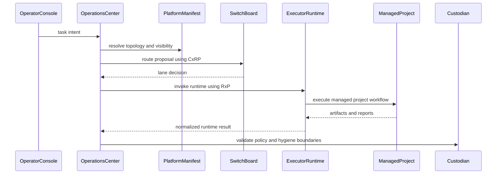

# Execution Flow

```mermaid
sequenceDiagram
    participant OC as OperatorConsole
    participant OPS as OperationsCenter
    participant PM as PlatformManifest
    participant SB as SwitchBoard
    participant ER as ExecutorRuntime
    participant MP as ManagedProject
    participant CU as Custodian

    OC->>OPS: task intent
    OPS->>PM: resolve topology and visibility
    OPS->>SB: route proposal using CxRP
    SB-->>OPS: lane decision
    OPS->>ER: invoke runtime using RxP
    ER->>MP: execute managed project workflow
    MP-->>ER: artifacts and reports
    ER-->>OPS: normalized runtime result
    OPS->>CU: validate policy and hygiene boundaries
```
