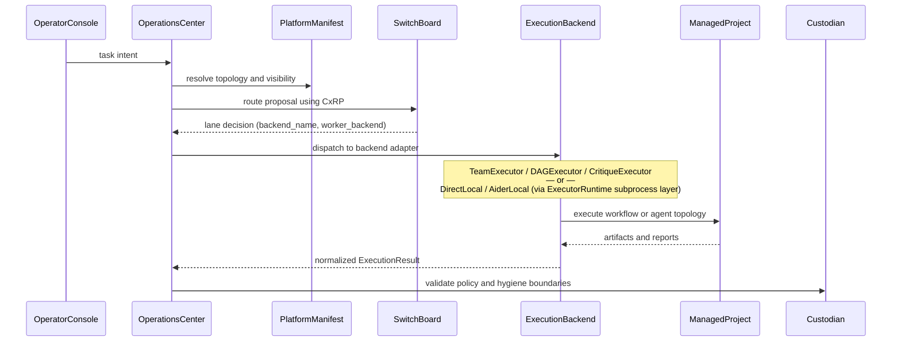

# Execution Flow



## AI execution backends (ADR 0005)

The three AI execution backends implement distinct multi-agent topologies:

| Backend | Pattern | Primary use |
|---------|---------|-------------|
| TeamExecutor | Coordinator → workers → verifier cycles | Team topology, parallel agent stages |
| DAGExecutor | DAG with concurrent layer execution | Structured multi-step workflows |
| CritiqueExecutor | Adversarial proposer/critic or Reflexion | Quality-gated tasks, adversarial review |

All three call the Claude Code or Codex CLI via subprocess internally
(`worker_backend` from SwitchBoard lane decision).

## Direct-local and aider-local adapters

For simpler single-agent tasks, OperationsCenter uses its `direct_local` and
`aider_local` adapters. These delegate subprocess mechanics to
**ExecutorRuntime** — a library that provides process-group-safe child process
execution, timeout enforcement, and stdout/stderr capture to files.

```
DirectLocalBackendAdapter → ExecutorRuntime.run() → SubprocessRunner → claude CLI
AiderLocalBackendAdapter  → ExecutorRuntime.run() → SubprocessRunner → aider CLI
```

ExecutorRuntime is not an AI execution backend; it is a subprocess mechanics
library shared by those two adapters.

## worker_backend propagation

SwitchBoard encodes the CLI backend preference (`claude_code` or `codex_cli`)
in `LaneDecision.metadata["worker_backend"]`. OperationsCenter forwards this
through the adapter into the executor, where it controls which CLI is spawned.
