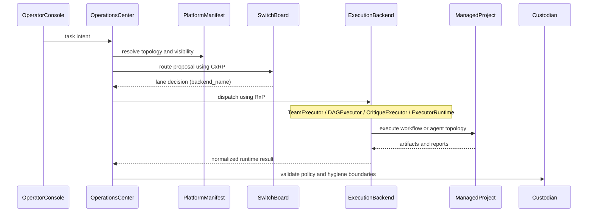

# Execution Flow

## Execution backends (ADR 0005)

| Backend | Pattern | Primary use |
|---------|---------|-------------|
| TeamExecutor | Coordinator → workers → verifier | Team topology, parallel agent tasks |
| DAGExecutor | DAG with concurrent layer execution | Structured multi-step workflows |
| CritiqueExecutor | Adversarial proposer/critic or Reflexion | Quality-gated tasks, adversarial review |
| ExecutorRuntime | Managed project via RxP | Direct-local execution, single-agent tasks |
