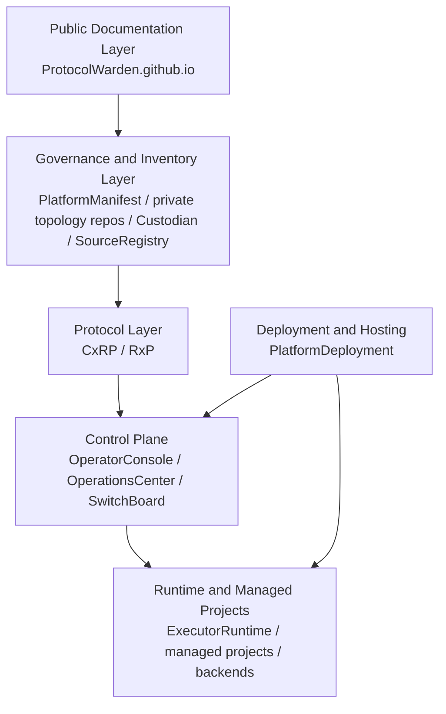

# Layered Architecture

The ecosystem is easiest to understand as layered responsibilities.

## Interpretation

- documentation explains the ecosystem
- governance and inventory describe and constrain it
- protocol repos define canonical semantics
- control-plane repos make decisions
- runtime systems execute work
- hosting systems run the local environment
