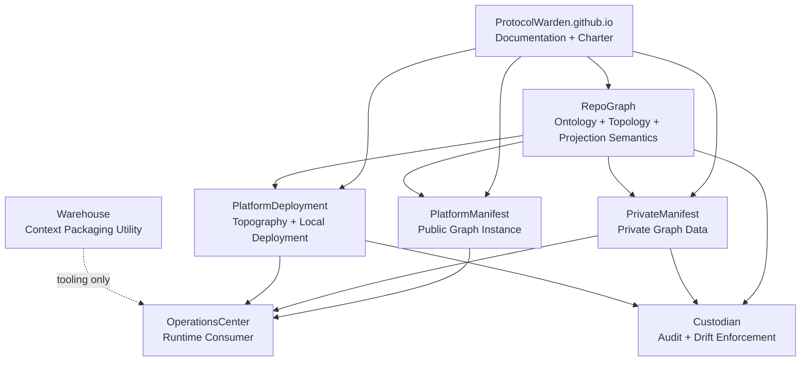
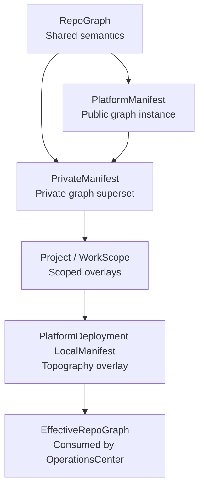
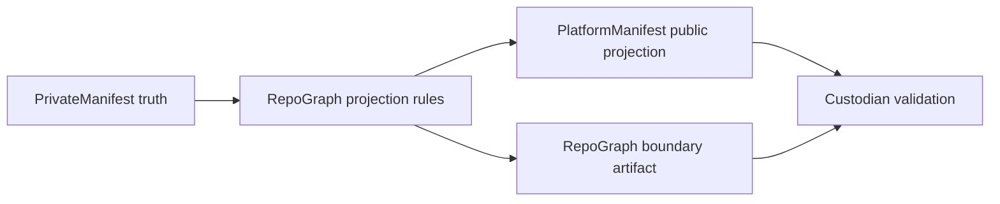

# Platform Architecture Charter

`ProtocolWarden.github.io` is the canonical public architecture charter for the
ProtocolWarden ecosystem. It explains what planes exist, what each plane owns,
what each plane must not own, and how the public, private, and local manifest
layers fit together.

## Charter vs Manifest

The charter is doctrine. It states what must be true.

The manifest repositories and enforcement tools implement that doctrine:

```text
ProtocolWarden.github.io   = architecture charter, doctrine, public explanation
RepoGraph                  = shared graph semantics library
PlatformManifest           = public graph instance / public projection publisher
PrivateManifest            = private graph instance / private superset truth
PlatformDeployment         = local/private deployment topography
Custodian                  = boundary artifact consumer and drift enforcement
OperationsCenter           = runtime consumer of composed graph truth
```

The charter is not the execution engine and it is not the schema authority.

## Plane Definitions

### Ontology

Ontology answers:

```text
What exists?
What does it mean?
```

Examples:

- repo kinds
- system kinds
- platform plane names
- owner kinds
- visibility classes
- capability categories

### Topology

Topology answers:

```text
How is it connected?
```

Topology edges are broader than imports or API calls. Valid platform topology
edges include:

- consumes manifest
- publishes projection
- reads artifact
- writes artifact
- dispatches request
- polls status
- indexes output
- validates output
- owns schema
- implements adapter
- invokes runtime
- deploys
- hosts

### Topography

Topography answers:

```text
Where and how is the platform deployed in a concrete environment?
```

Examples:

- local paths
- compose files
- ports
- env overlays
- host-specific runtime placement
- cache roots
- machine-local endpoints

Topography belongs to `PlatformDeployment`, not `PlatformManifest`. `RepoGraph`
may carry only the shared topography definitions that deployment consumers
choose to adopt later.

### Projection

Projection answers:

```text
How does private truth become public-safe truth?
```

Examples:

- hide private repo names
- rename private entities
- redact local paths
- drop unsafe edge kinds
- expose only public-safe topology views

## Ownership Table

| Repo | Owns | Must Not Own |
| --- | --- | --- |
| `ProtocolWarden.github.io` | public charter, public diagrams, doctrine | executable manifest semantics, private topology data, local deployment state |
| `RepoGraph` | shared ontology, topology, projection vocabulary, validation primitives, boundary artifact semantics | orchestration behavior, private graph truth, deployment overlays |
| `PlatformManifest` | public graph instance, loaders, validators, public-safe projection publication | canonical graph semantics, private topology data, local topography, orchestration behavior, CxRP/RxP semantics |
| `PrivateManifest` | private graph data, private repo identities, visibility metadata, boundary artifact generation | canonical ontology semantics, canonical projection algorithm semantics, local deployment state |
| `PlatformDeployment` (current repo: `WorkStation`) | local/private topography, runtime placement, env overlays, ports, compose layout | ontology, public topology language, private topology truth, orchestration policy |
| `Custodian` | audit rules, drift checks, projection safety checks, boundary validation, reports | topology truth, projection truth, orchestration behavior, deployment state |
| `OperationsCenter` | orchestration behavior, task binding, dispatch, runtime consumption of composed manifest truth | canonical ontology, private manifest data, projection policy definitions, local deployment topology |
| `Warehouse` | code-context packaging utility behavior, kits, crates, pallets, yard mechanics | platform spine semantics, topology truth, registry truth, orchestration, governance |

## Public, Private, and Local Layering

```text
RepoGraph
    = shared graph semantics

PlatformManifest
    = public graph instance and public-safe publisher

PrivateManifest
    = private graph superset expressed with RepoGraph semantics

Project / WorkScope manifests
    = scoped overlays for project and work assembly

PlatformDeployment local manifests
    = machine/runtime topography overlays only
```

Composition order:

```text
platform -> private -> (project or work_scope) -> local
```

## Warehouse Downgrade Note

`Warehouse` is intentionally not part of the platform spine.

It is a context-packaging utility for code selection, chunking, staging, and
debugging workflows. It must not be modeled as:

- topology owner
- registry owner
- scheduler
- governance authority
- runtime artifact dependency for managed projects

## Dependency Direction

```text
ProtocolWarden.github.io documents everything

RepoGraph defines the language
PlatformManifest and PrivateManifest import that language
PlatformDeployment uses composed output for local deployment/topography
OperationsCenter consumes composed truth for orchestration
Custodian consumes RepoGraph-derived boundary artifacts and verifies drift
```

Avoid circular authority:

- private topology repositories must not define platform language
- `PlatformDeployment` must not define platform language
- `OperationsCenter` must not define platform language
- `Warehouse` must not define platform language
- `Custodian` must not define platform truth

## Enforcement Model

```text
The charter states what must be true.
RepoGraph encodes the shared graph language.
PlatformManifest publishes the public graph instance.
PrivateManifest declares private truth in that language and derives boundary artifacts.
PlatformDeployment declares local deployment/topography overlays.
Custodian verifies that declarations, generated projections, and boundary artifacts do not drift from the rules.
OperationsCenter consumes composed manifest truth at runtime.
```

## Diagrams

### Platform Planes



### Manifest Layering



### Projection Flow


