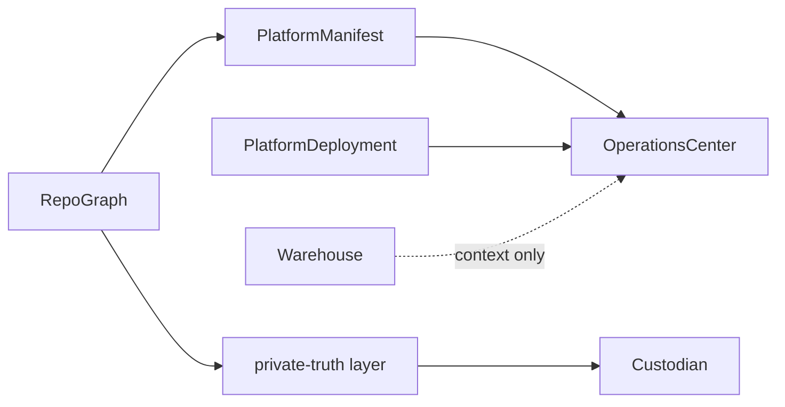
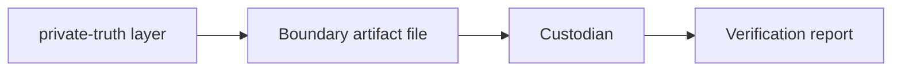
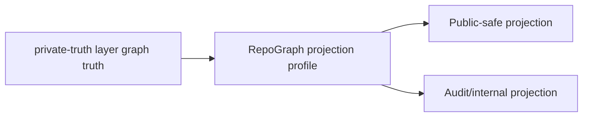

# Simple Platform Model

RepoGraph defines the language.
private-truth layer stores private truth.
PlatformManifest publishes safe public views.
Custodian verifies boundaries.
OperationsCenter orchestrates.
PlatformDeployment deploys.
Warehouse packages context.
ProtocolWarden/ProtocolWarden is the short public front door.
ProtocolWarden.github.io is the full public knowledge surface.

## Flow

## Boundary artifact flow

## Projection profile flow

The simple model is descriptive only. The RepoGraph schema, projection, and
boundary rules still enforce the actual boundaries.
