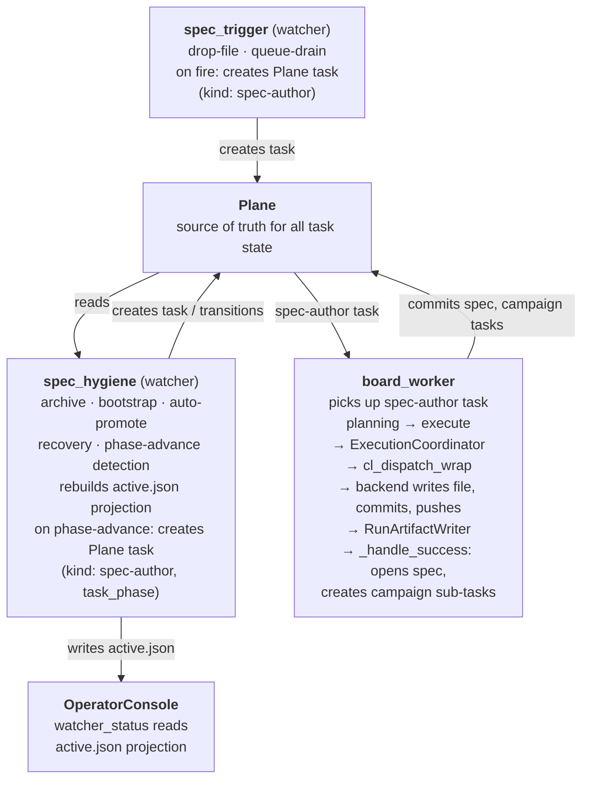

# Spec Director Refactor

How OperationsCenter's `spec_director` was decomposed so that **every LLM call
goes through the backend executor** — closing audit, lifecycle, and provenance
gaps that direct-Claude code paths had left open.

Canonical decision record: OperationsCenter ADR 0007.

## Context

`spec_director` was a single watcher containing three Claude-bypassing paths
(board hygiene, campaign generation, phase orchestration). Two of them called
Claude directly, skipping model-binding policy, rate limiting, retry, the audit
trail, and lifecycle capture — a generated spec just appeared on disk with no
`run_id` provenance.

## Decision

Fold all LLM-needing operations through the normal
`Plane task → board_worker → ExecutionCoordinator → backend` pipeline. Split the
non-LLM operations into focused watchers that **emit Plane tasks** instead of
executing work themselves.

| Concern | Owner | LLM? |
|---|---|---|
| Hygiene (archive, bootstrap, auto-promote, recovery) | `spec_hygiene` watcher | No |
| Trigger detection (drop-file, queue-drain) | `spec_trigger` watcher | No |
| Spec generation execution | `board_worker` via `spec-author` task-kind | Yes (via backend) |
| Phase orchestration LLM step | Same `spec-author` handler, `task_phase` label | Yes (via backend) |

## Architecture

## Key invariants

- **All LLM calls go through the backend executor.** `_claude_cli.py` is
  deleted; a CI grep guard prevents reintroduction.
- **Plane is single-source-of-truth for task state.**
  `state/campaigns/active.json` is a Plane-derived projection rebuilt by
  `spec_hygiene` each cycle; OperatorConsole reads it (single writer).
- **Audit trail is end-to-end closed:** the spec file embeds
  `generated_by_run: <run_id>`, campaign sub-tasks carry `parent_run`, and
  `run_metadata.json` records `spec_slug` for `spec-author` tasks — any spec
  traces back to its execution.

## Related

- Sync & Data Transport — the same manifest-as-authority and shim-contract
  patterns recur there.
