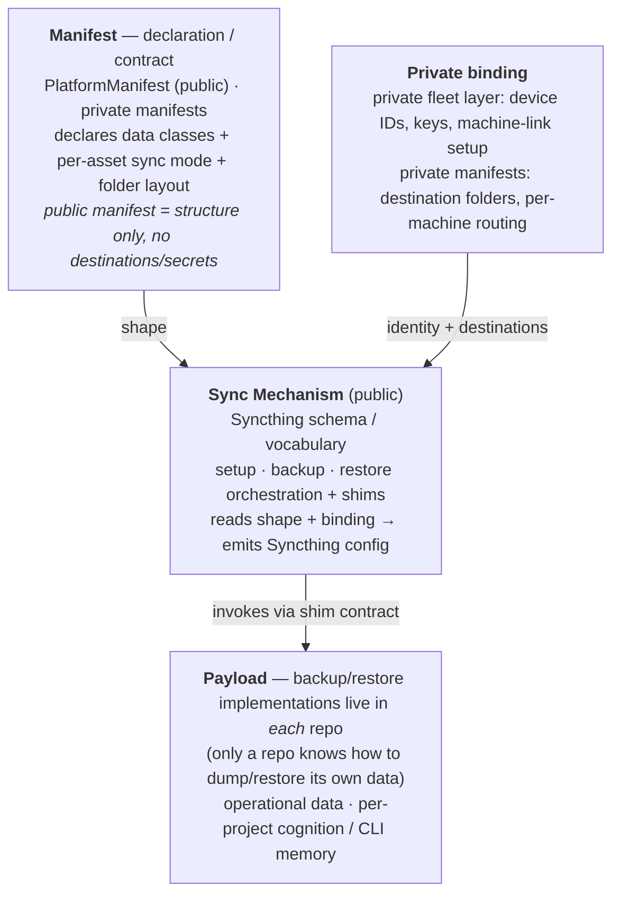

# Sync & Data Transport

How operational and cognition data moves between machines in the ProtocolWarden
fleet, and which repo owns which part of that movement.

The organizing principle: **group by manifest, never by data-type.** The
manifest is already the scoping authority — it declares the ecosystem, hosts
cognition, and anchors sessions. "What data syncs, from where, to where,
organized how" is one more thing the manifest *declares*. That keeps the design
from sprawling into a repo-per-data-type-per-project explosion: there is one
sync surface per manifest, and new data is a declaration, not a new repo.

## Layers

Three layers, following the ecosystem's public-mechanism / private-binding
split.

## Layers and ownership

| Layer | Role | Visibility |
|---|---|---|
| Manifests | Declare sync layout (data classes, modes, folder layout) for their scope | Public / Private |
| Sync Mechanism | Syncthing schema/vocabulary; setup/backup/restore orchestration + shim contract | Public, configurable |
| Private fleet layer | Machine identity keys, machine-link setup scripts | Private |
| Each participating repo | Owns its backup/restore implementation behind the shim contract | per-repo |

The private fleet layer (machine identity keys + link-setup scripts) is kept
distinct from the SSH key index, which only tracks SSH keys and their lifecycle
(in use / rotated / retired).

## Sync modes

Defined in the public Sync Mechanism repo, chosen per-asset in the manifest:

| Mode | Meaning | Example |
|---|---|---|
| `copy` | Small things snapshotted into a `sync/` directory | configs, work items, campaigns |
| `in-repo` | Large things synced in place | large model / media assets |
| `external` | Cannot live in-repo; synced from an out-of-tree location | large backup archives |

## Invariants

- The manifest is the only place grouping is defined; new data is a declaration
  in an existing manifest, never a new data-type repo.
- A public manifest declares structure only — never destinations, device IDs, or
  secrets. Those inject from the private layer.
- Backup/restore implementations live in their own repo, behind a shim contract
  owned by the public mechanism.
- Payload location and sync mode are declared per-asset; the mechanism's
  vocabulary defines the legal modes.
- Coverage is observable — an asset with no declared sync mode is a detectable
  gap, not a silent omission.
