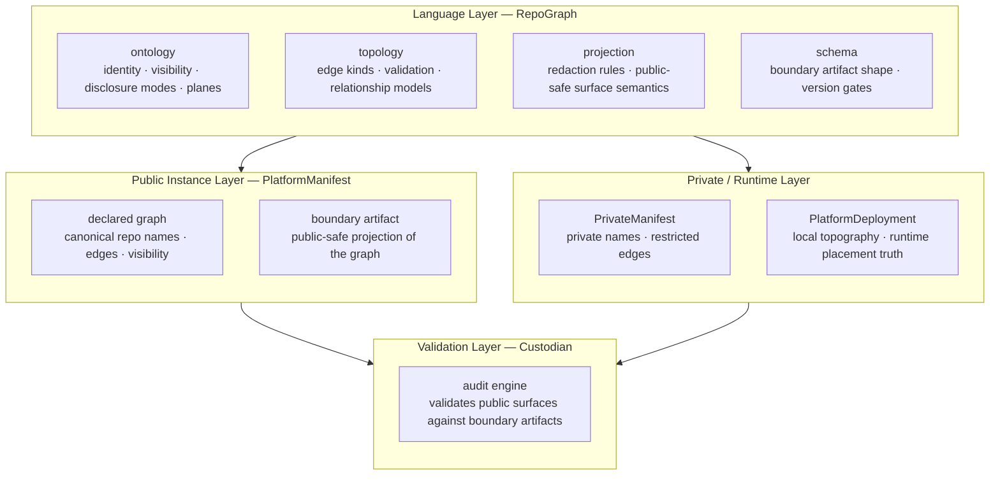

# Graph Layer Stack

How the platform builds a complete picture of itself — from shared vocabulary to
public projection to local deployment truth.

## Layer Responsibilities

| Layer | Repo | Owns | Does Not Own |
|-------|------|------|--------------|
| Language | RepoGraph | graph vocabulary — ontology, topology, projection semantics, artifact schemas | graph instances, runtime placement truth |
| Public Instance | PlatformManifest | canonical public graph declaration, boundary artifact publication | graph language definitions, deployment truth |
| Private/Runtime | PrivateManifest, PlatformDeployment | private name overlays, local runtime topography | public projection rules, graph language |
| Validation | Custodian | auditing public repos against boundary artifacts | graph authoring, publication |

## The Topography Boundary

RepoGraph owns the **vocabulary** for topography — what a plane, edge kind, or
deployment node *means*. It does not own runtime placement truth.

Actual deployment truth — which service runs where, which node is provisioned —
lives in PlatformDeployment and local manifests. RepoGraph gives them the
language to express that truth consistently.
