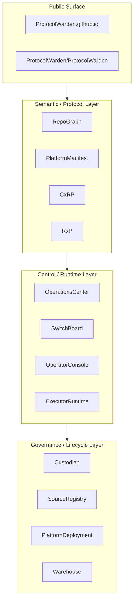

# Ecosystem Layered Stack

## Layer descriptions

| Layer | Purpose |
| --- | --- |
| Public Surface | Public-facing knowledge and orientation surfaces |
| Semantic / Protocol Layer | Graph language, public projection, execution and runtime contracts |
| Control / Runtime Layer | Orchestration, routing, operator entry, runtime invocation |
| Governance / Lifecycle Layer | Audit, source tracking, deployment, context packaging |
