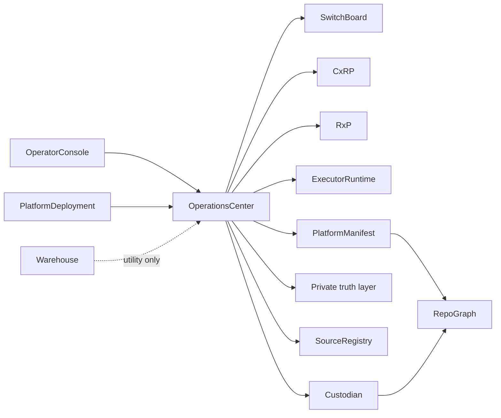

# Repo Constellation

Full repo graph showing primary dependencies and data flows.

## Notes

- `private-truth layer` is not a browseable public repo; it is named here as a
  boundary participant.
- `WH` (Warehouse) is utility-only — it packages context but does not govern or
  orchestrate.
- `PD` (PlatformDeployment) feeds the control plane at the environment level.
