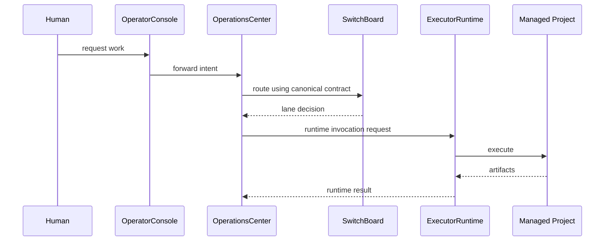

# Execution Sequence

```mermaid
sequenceDiagram
    participant Human
    participant Console as OperatorConsole
    participant OC as OperationsCenter
    participant SB as SwitchBoard
    participant ER as ExecutorRuntime
    participant Managed as Managed Project

    Human->>Console: request work
    Console->>OC: forward intent
    OC->>SB: route using canonical contract
    SB-->>OC: lane decision
    OC->>ER: runtime invocation request
    ER->>Managed: execute
    Managed-->>ER: artifacts
    ER-->>OC: runtime result
```
