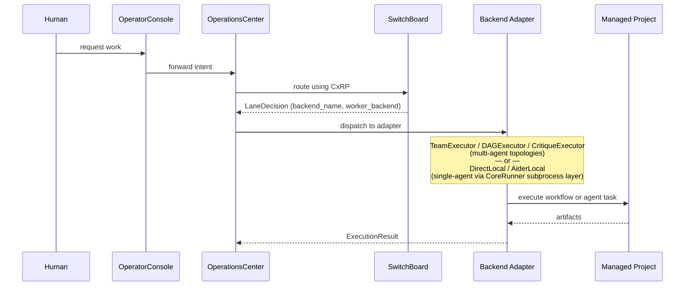

# Execution Sequence

## Notes

- **TeamExecutor / DAGExecutor / CritiqueExecutor** implement their own coordinator/worker/verifier
  or DAG topologies and call the Claude Code or Codex CLI directly via subprocess.
- **DirectLocal / AiderLocal** are simpler single-agent adapters that use **CoreRunner**
  as a subprocess mechanics library (process-group safety, timeout, stdout/stderr capture).
- CoreRunner is a library dependency of the DirectLocal/AiderLocal adapters,
  not a standalone actor in this sequence.
