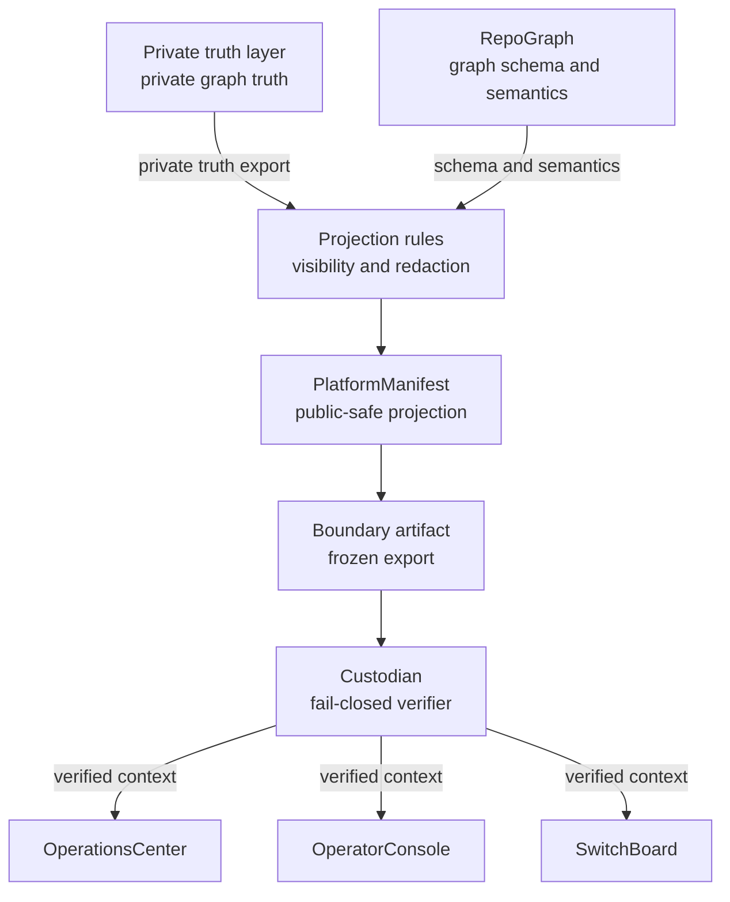

# Public / Private Projection Flow

Shows how private truth becomes a public-safe projection and how enforcement consumes it.

## Rules

- Private truth never flows directly to consumers — it passes through projection
  and redaction first.
- `PlatformManifest` owns the public-safe projection surface; it does not own
  private truth.
- `Custodian` fails closed when the boundary artifact is absent.
- Consumers (`OperationsCenter`, `OperatorConsole`, `SwitchBoard`) receive
  verified public-safe context only.
- Local manifests used at runtime are never published to the public surface.
