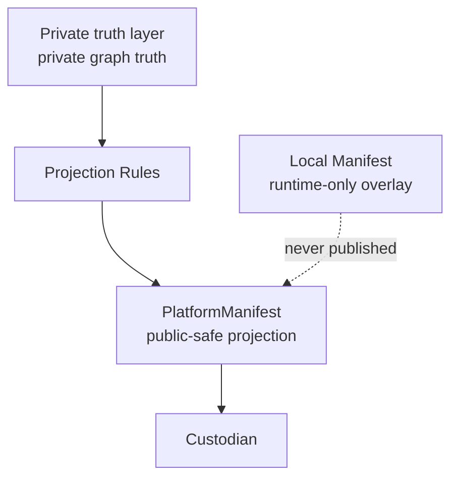

# Manifest Projection

```mermaid
graph TD
    Private[Private truth layer\nprivate graph truth]
    Rules[Projection Rules]
    Public[PlatformManifest\npublic-safe projection]
    Local[Local Manifest\nruntime-only overlay]
    Custodian[Custodian]

    Private --> Rules
    Rules --> Public
    Local -. never published .-> Public
    Public --> Custodian
```
