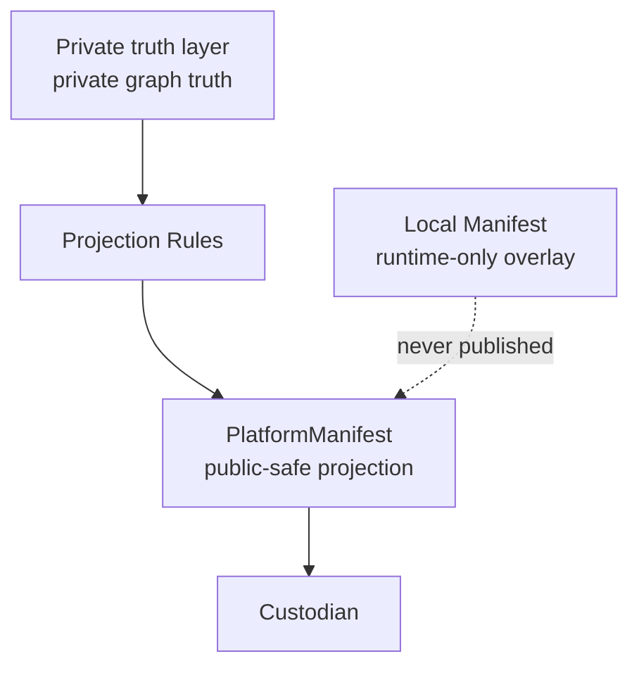

# Manifest Projection

```mermaid
graph TD
    Private["Private truth layer<br/>private graph truth"]
    Rules["Projection Rules"]
    Public["PlatformManifest<br/>public-safe projection"]
    Local["Local Manifest<br/>runtime-only overlay"]
    Custodian["Custodian"]

    Private --> Rules
    Rules --> Public
    Local -. never published .-> Public
    Public --> Custodian
```
