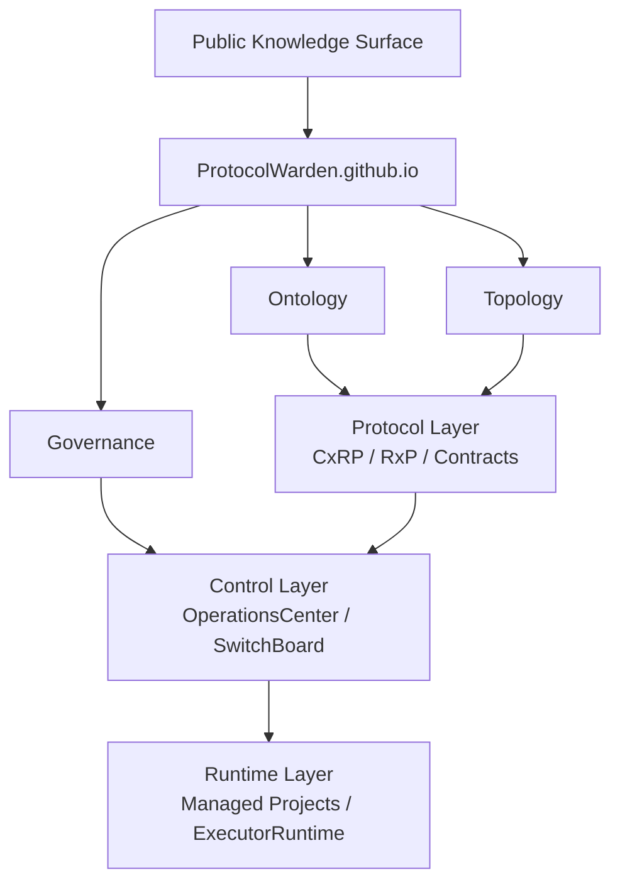
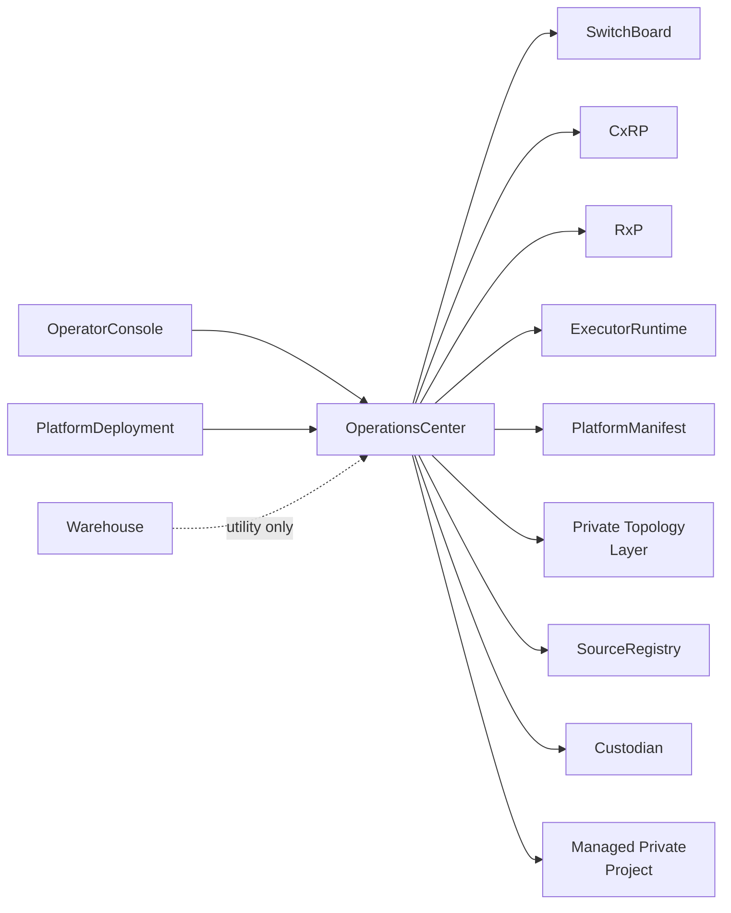

# ProtocolWarden

ProtocolWarden.github.io is the canonical public-facing knowledge surface for
the ProtocolWarden ecosystem.

It explains:

- what exists
- why it exists
- how it connects
- what boundaries are enforced
- how contracts interact
- how execution flows
- how governance works
- what is public vs private

## What This Site Is

- the public documentation surface
- the ecosystem entrypoint
- the architecture explanation layer
- the protocol and specification hub
- the ontology and topology explorer
- the governance and public-projection layer

## What This Site Is Not

- a runtime system
- an orchestration layer
- a deployment manager
- a backend service
- an execution environment

## Start Here

- [Getting Started](getting-started/index.md)
- [Ecosystem Overview](overview/ecosystem.md)
- [Layered Architecture](architecture/layered-architecture.md)
- [Protocol Overview](protocols/index.md)
- [Repository Catalog](repos/operationscenter.md)

## Ecosystem in 60 Seconds

ProtocolWarden is a contract-first platform built around explicit boundaries:

- `CxRP` owns cross-repo execution and routing semantics
- `RxP` owns runtime invocation semantics
- `OperationsCenter` owns orchestration and governance behavior
- `SwitchBoard` owns lane and backend selection
- `ExecutorRuntime` owns runtime invocation mechanics
- `PlatformManifest` owns the public topology language and visibility model
- a private topology layer supplies private truth in that language
- `Custodian` owns privacy, hygiene, and drift detection enforcement
- `PlatformDeployment` (current repo: `WorkStation`) owns deployment and local
  hosting concerns

## Initial Homepage Diagram

## Core Repo Constellation

## Protocol Stack Summary

- **Contracts:** CxRP, RxP
- **Control plane:** OperatorConsole, OperationsCenter, SwitchBoard
- **Runtime layer:** ExecutorRuntime, managed backends, managed projects
- **Inventory and governance:** PlatformManifest, private topology inputs,
  Custodian, SourceRegistry, PlatformDeployment
- **Utility tooling:** Warehouse

## Documentation Philosophy

This repository exists to preserve architectural intent and reduce cognitive
load. The public site should make the ecosystem understandable without forcing
contributors to reverse-engineer the platform from source alone.
