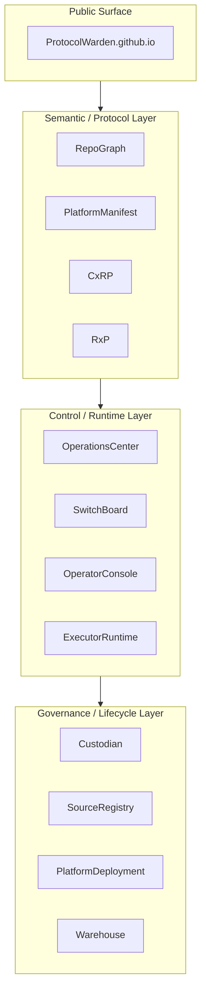
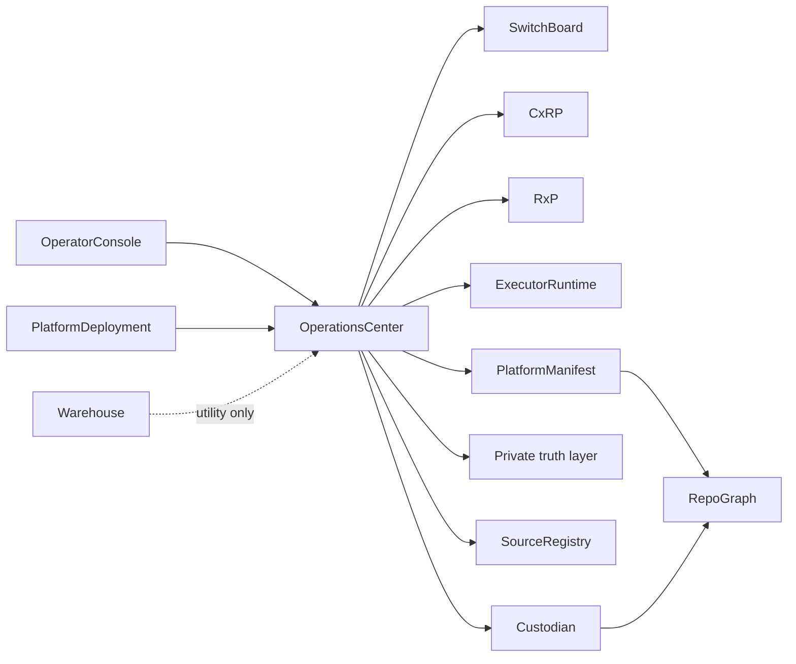

# ProtocolWarden

ProtocolWarden is a contract-first AI operations ecosystem organized around
semantic repo graphs, execution protocols, policy-controlled routing, runtime
adapters, and public-safe architecture projection.

---

This site is the canonical public knowledge surface for the ecosystem. It
explains what exists, how it fits together, what boundaries are enforced, and
what is public versus private.

The short front door is the
[GitHub profile README](https://github.com/ProtocolWarden/ProtocolWarden).
The [GitHub org](https://github.com/ProtocolWarden) lists all public repos.

## This Site Is

- the public documentation surface
- the architecture explanation layer
- the protocol and specification hub
- the ontology and topology explorer
- the governance and boundary reference

## This Site Is Not

- a runtime system
- an orchestration layer
- a deployment manager
- a backend service
- an execution environment

## Start Here

- [Profile README — public front door](https://github.com/ProtocolWarden/ProtocolWarden)
- [GitHub org](https://github.com/ProtocolWarden)
- [Getting Started](getting-started/index.md)
- [Ecosystem Overview](overview/ecosystem.md)
- [Ecosystem Role Matrix](overview/ecosystem-role-matrix.md)
- [Layered Architecture](architecture/layered-architecture.md)
- [Protocol Overview](protocols/index.md)
- [Repository Catalog](repos/index.md)
- [Public Repo Catalog Policy](governance/public-repo-catalog.md)

## Ecosystem Architecture

## Core Repo Constellation

## Ecosystem in 60 Seconds

- `CxRP` owns cross-repo execution and routing semantics
- `RxP` owns runtime invocation semantics
- `OperationsCenter` owns orchestration and governance behavior
- `SwitchBoard` owns lane and backend selection
- `ExecutorRuntime` owns runtime invocation mechanics
- `RepoGraph` owns the shared ontology, topology, projection, and boundary language
- `PlatformManifest` publishes the public graph instance and public-safe projections
- the private-truth layer supplies private graph truth in that language
- `Custodian` consumes RepoGraph boundary artifacts and enforces public-surface drift checks
- `PlatformDeployment` owns deployment and local hosting concerns
- adjacent backend consumers are runtime and content-pipeline consumers

For a short operator model, see
[architecture/simple-platform-model.md](architecture/simple-platform-model.md).

## Protocol Stack Summary

- **Contracts:** CxRP, RxP
- **Control plane:** OperatorConsole, OperationsCenter, SwitchBoard
- **Runtime layer:** ExecutorRuntime, adjacent backend consumers, managed backends
- **Inventory and governance:** PlatformManifest, Custodian, SourceRegistry, PlatformDeployment
- **Utility tooling:** Warehouse

## Operational References

- [RepoGraph Post-PASS Hardening Baseline](architecture/stable-baselines/repograph-post-pass-hardening-v1.md)
- [Semantic Federation](operations/semantic-federation.md)

## Documentation Philosophy

This repository exists to preserve architectural intent and reduce cognitive
load. The public site makes the ecosystem understandable without forcing
contributors to reverse-engineer the platform from source. For the short front
door, see the separate
[ProtocolWarden](https://github.com/ProtocolWarden/ProtocolWarden) repository.
