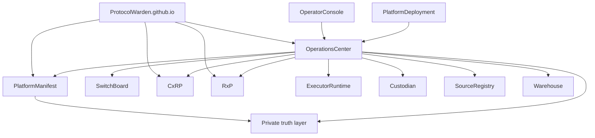

# Ecosystem Map

```mermaid
graph TD
    DOCS[ProtocolWarden.github.io]
    PM[PlatformManifest]
    PT[Private truth layer]
    OC[OperatorConsole]
    OPS[OperationsCenter]
    SB[SwitchBoard]
    CX[CxRP]
    RX[RxP]
    ER[ExecutorRuntime]
    CU[Custodian]
    WS[PlatformDeployment]
    SR[SourceRegistry]
    WH[Warehouse]

    DOCS --> PM
    DOCS --> CX
    DOCS --> RX
    DOCS --> OPS
    PM --> PT
    OC --> OPS
    OPS --> SB
    OPS --> ER
    OPS --> CU
    OPS --> PT
    OPS --> SR
    OPS --> WH
    OPS --> PM
    OPS --> CX
    OPS --> RX
    WS --> OPS
```
