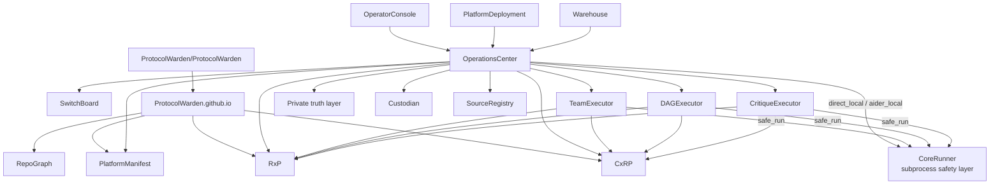

# Ecosystem Graph

CoreRunner is the canonical subprocess safety library for all backends.
OC's `direct_local` and `aider_local` use `CoreRunner.run()` (full RxP path).
TeamExecutor, DAGExecutor, and CritiqueExecutor use `core_runner.safe_run()` (lightweight primitive).
