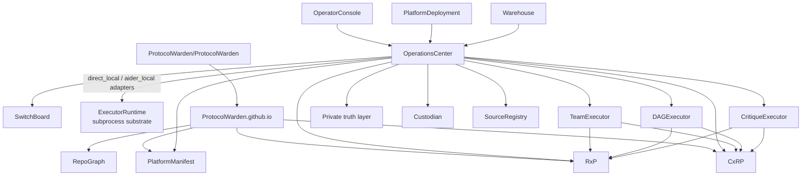

# Ecosystem Graph

ExecutorRuntime is a subprocess mechanics library — not a peer AI execution backend.
It is used by OC's `direct_local` and `aider_local` adapters only.
TeamExecutor, DAGExecutor, and CritiqueExecutor do not use it.
