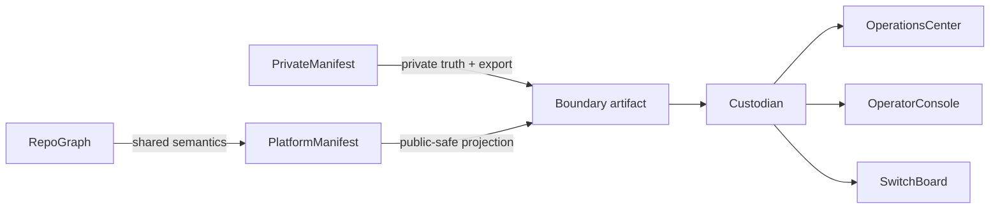

# Semantic Boundary Workflow

This page describes the current enforcement path from private truth to public
verification.

## Core flow

1. `RepoGraph` defines the shared graph language.
2. `PrivateManifest` owns private truth and exports the boundary artifact.
3. `PlatformManifest` publishes the public-safe projection surface.
4. `Custodian` validates the boundary artifact before scanning public repos.
5. `OperationsCenter`, `OperatorConsole`, and `SwitchBoard` consume verified
   public-safe context without owning graph semantics.

## Important rule

`Custodian` fails closed when `REPOGRAPH_BOUNDARY_ARTIFACT_FILE` is missing.
Automation belongs before Custodian runs, not inside Custodian's semantic core.

